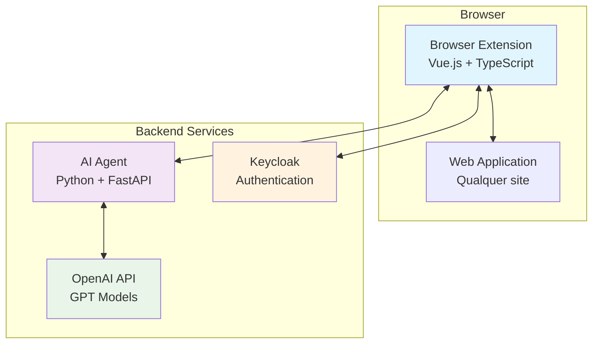
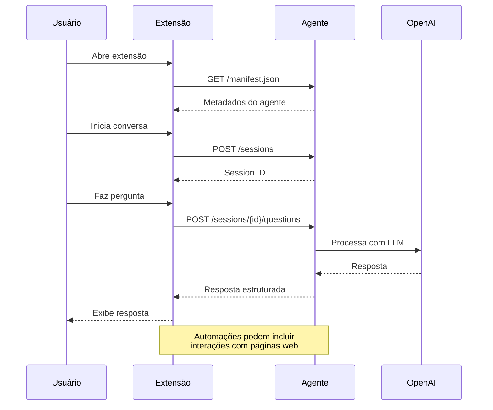
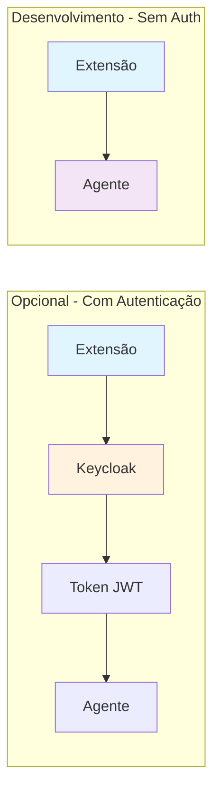
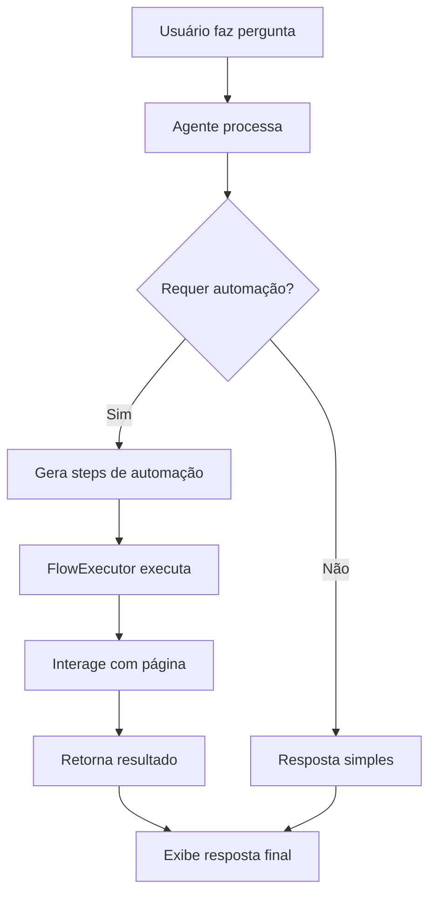
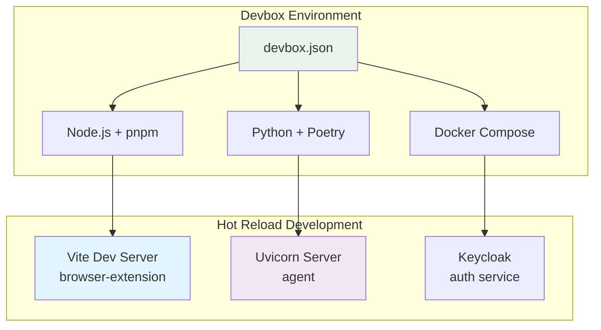
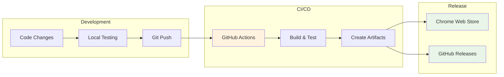
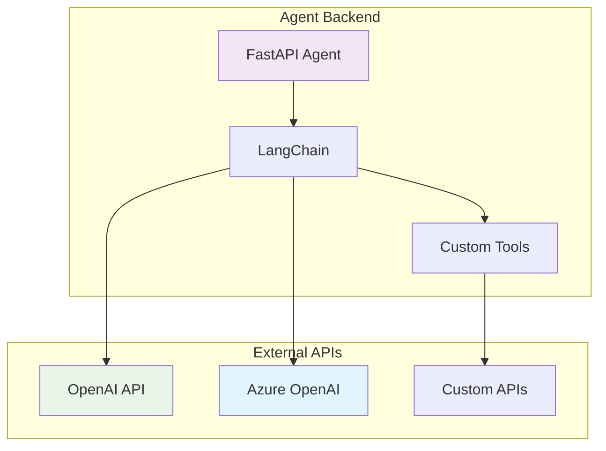
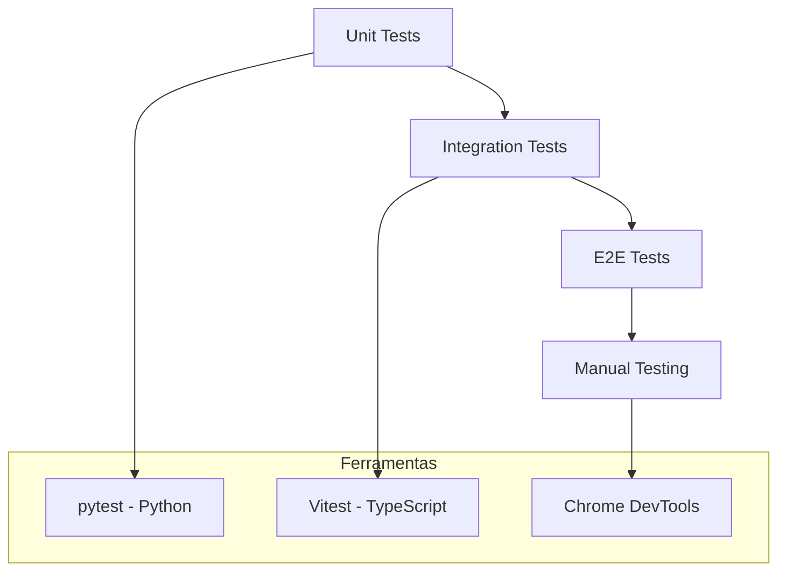
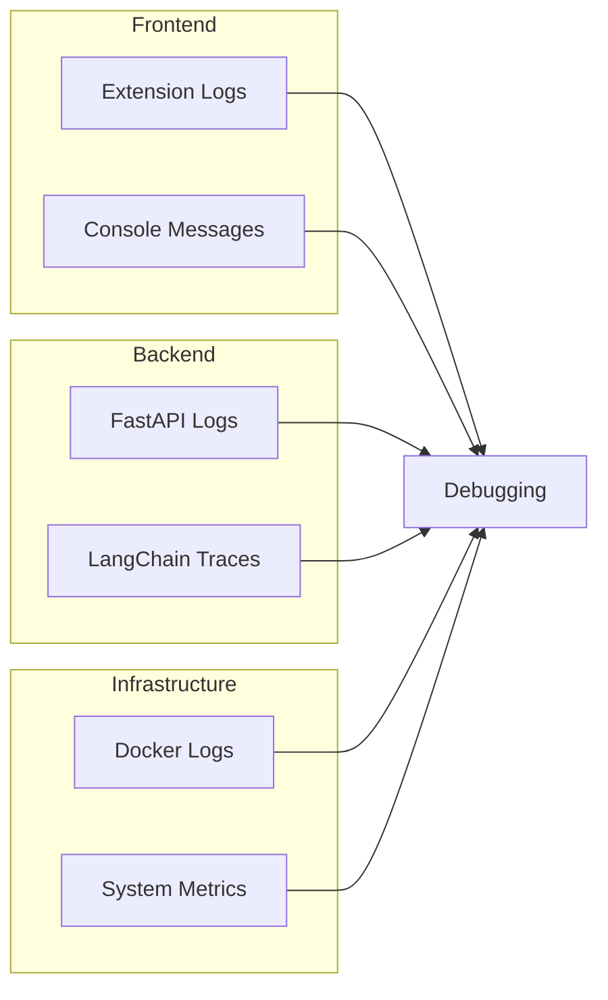

# Arquitetura do Browser Copilot

## 🏗️ Visão Geral da Arquitetura



## 🔄 Fluxo de Comunicação



## 🧩 Componentes Principais

### 1. Browser Extension

```
browser-extension/
├── src/
│   ├── background.ts        # Service Worker Principal
│   ├── side-panel.ts        # Content Script
│   ├── pages/Popup.vue      # Interface Principal
│   ├── components/          # Componentes Vue
│   │   ├── Chat.vue         # Interface de Chat
│   │   ├── AgentList.vue    # Lista de Agentes
│   │   └── Settings.vue     # Configurações
│   └── scripts/
│       ├── agent.ts         # Comunicação com Agentes
│       ├── flow.ts          # Automação de Fluxos
│       └── auth.ts          # Autenticação
```

### 2. AI Agents

```
agent-*/
├── gpt_agent/
│   ├── __main__.py          # Entry Point
│   ├── agent.py             # FastAPI App
│   ├── api.py               # Endpoints API
│   ├── auth.py              # Autenticação
│   ├── domain.py            # Modelos de Dados
│   └── assets/
│       ├── manifest.json    # Metadados
│       └── logo.png         # Logo
```

## 🔐 Fluxo de Autenticação



## ⚙️ Automação de Fluxos

A extensão pode automatizar interações com páginas web:



### Tipos de Automação Suportados:

- **GOTO** - Navegar para URL
- **CLICK** - Clicar em elementos
- **FILL** - Preencher formulários
- **SCROLL** - Rolar página
- **MESSAGE** - Exibir mensagens

## 🛠️ Ambiente de Desenvolvimento



## 📦 Build e Deploy Pipeline



## 🔌 Integração com APIs Externas



## 🧪 Estratégia de Testes



## 📊 Monitoramento e Observabilidade



---

Esta arquitetura permite desenvolvimento ágil, escalabilidade e fácil manutenção do Browser Copilot, com separação clara de responsabilidades entre frontend e backend.